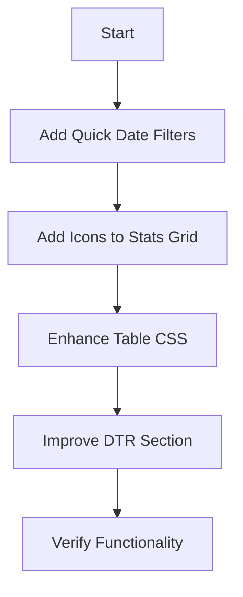

# Reports Page UI/UX Improvement Plan

## Objective

Improve the overall UI/UX of the `reports.php` page to make it easier to understand and navigate, while ensuring all existing functionality remains intact.

## Current Analysis

- **Structure**: Single-page report with filters, summary stats, per-user table, and detailed DTR (Daily Time Record) section.
- **Issues**:
  - Dense information layout (15+ columns in tables).
  - No quick date filters (users must manually pick dates).
  - Stats grid lacks visual icons.
  - DTR section is hidden until a user is selected, which can be confusing.
  - Tables lack visual separation (zebra striping).

## Plan

### 1. Quick Filters (User Experience)

Add quick selection buttons for common date ranges to reduce manual input.

- **Location**: `reports.php` (Filter Bar)
- **Implementation**:
  - Add "This Week", "Last Week", "This Month", "Last Month" buttons.
  - Use JavaScript to dynamically update the `start` and `end` date inputs and submit the form, or redirect with updated query parameters.

### 2. Visual Stats Enhancement

Improve the "Stats Grid" by adding icons.

- **Location**: `reports.php` (Stats Grid)
- **Implementation**:
  - Add specific FontAwesome icons to each `stat-card`:
    - Tasks Completed: `fa-check-circle` (Green)
    - Tasks In Progress: `fa-spinner` (Blue)
    - Overdue Tasks: `fa-exclamation-triangle` (Red)
    - Total Hours: `fa-clock-o` (Purple)
    - Avg Task Rating: `fa-star` (Yellow)
    - Captures per Hour: `fa-camera` (Teal)

### 3. Table Enhancements

Make the "Per-User Breakdown" table easier to read.

- **Location**: `css/reports-page.css`
- **Implementation**:
  - Add zebra striping (alternating row colors) to `.report-table`.
  - Add hover effects to rows.
  - Improve header styling (sticky position is good, but ensure text contrast).

### 4. DTR Section Refinement

Improve the Daily Time Record (DTR) section.

- **Location**: `reports.php` & `css/reports-page.css`
- **Implementation**:
  - **Empty State**: Make the "Select a user" prompt more prominent and inviting.
  - **Input Layout**: Ensure the deduction inputs are aligned and compact.
  - **Visual Separation**: Add clear borders between dates in the DTR table for readability.

### 5. Functionality Check

Ensure no existing features are broken.

- **Check**:
  - Filtering by Group/User works.
  - Export (CSV, PDF) works.
  - DTR editing (deductions) works.
  - Print styles remain functional.

## Implementation Steps (Mermaid)

## Notes

- All changes will be made to `reports.php` and `css/reports-page.css`.
- No changes to backend logic (PHP) or database queries.
- Ensure FontAwesome is correctly linked (already present).
